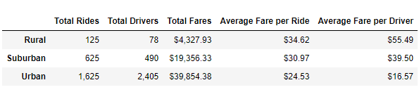
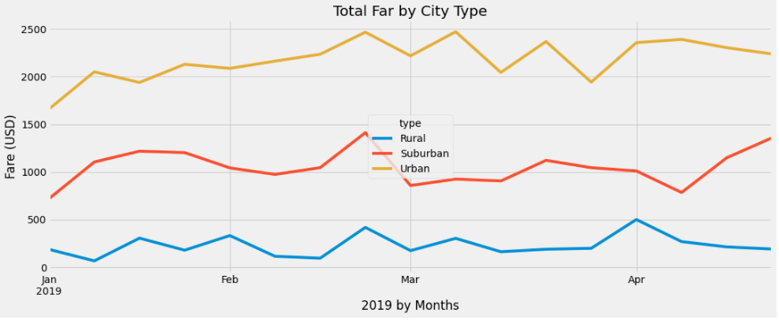

# PyBer_Analysis

## Overview
The purpose of this analysis was to create a summary DataFrame of ride-sharing data by city type. Moreover, a multi-line graph displaying each city type's total weekly fares was created to visualize the data from January 1, 2019 to April 28, 2019. This was analyzed to interpret how the data differs depending on the city type for this particular time period. Additionally, several recommendations are suggested to the PyBer CEO for ways to address disparaites and to optimize their business. 

## Results
As expected, urban city drivers accumulated the most amount of fares, rural drivers acccumulated the least amount of fares, and suburban drivers accumulated in a fare range in between urban and rural fare amounts. This also positively correlated with the number of drivers available for each city type as well. This was logically expected because of the population density in each of these city types. Quite simply, the higher the population density, the more potential customer fares and the more potential drivers as well. Even though the cost of individual rural fares are slightly higher than their counterparts in the city and suburbs, rural drivers simply lack the potential customer pool that these larger areas have access to. Despite this however, there was a reverse trend in the data when it came to the average cost of fares for the city types, as well as the average fare earnings per driver. Despite having the least amount of overall customers, rural drivers charged a higher average fare per ride and as such, received a higher average profit. Urban drivers were also the only drivers to outnumber their rides. See below for the complete breakdown:

Between the time period of January 2019 to the end of April 2019, city driver fares twice peaked close to $2,500 in fares. This was towards the end of February and in the beginning of March. Overall, city drivers experienced a period of peak business with a few minor dips beginning in February and lasting throughout April. The only true pattern that can be seen and determined based on the data in this time frame is that all drivers, relative to their respective city type, experienced one of their highest points of business (if not the actual highest) near the end of February. See below for a multiple-line chart visualizing the fare data for drivers in all city types:

## Summary
Based on the results, there are a few recommendations for PyBer that can possibly address the disparities among city types. Firstly, urban drivers were the only type of city drivers to outnumber the number of total rides. This means that there were most likely many available drivers who either did not have many fares, or may have possibly not had a fare at all during this time period. A possible solution to this issue is to promote themselves more or to potentially slightly reduce the cost even though the average fare is already lower than suburban and rural fares. It is more reasonable if all drivers have a chance to earn profit as opposed to the risk of insufficient work to suport themselves. An urban city will always by default have a larger customer base. Therefore, proper promotion and advertisement of the company and their competitive fare rates would continue to increase the customer pool.

Another recommendation is to try special periods of promoting lower fares for rural customers, specifically targeting the time periods where the dips in business appear the lowest. By enacting these specials, it can appeal to the customers to take advantage of these specials and thus, bolster the business during what would ordinarily otherwise be a low business period.

Lastly, it is highly likely the fares could be linked to the distance of the trip. Urban city trips are more likely to be shorter than rural trips. It would be a good recommendation to begin collecting data on the mileage/distance of the trips and analyze whether this impacts the profits of the fares in any manner. Perhaps rural trips produce higher average profits for the drivers because the trips take longer to complete and thus the fares cost more.
